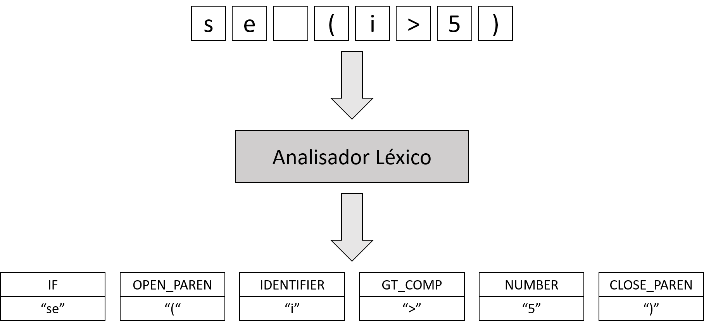
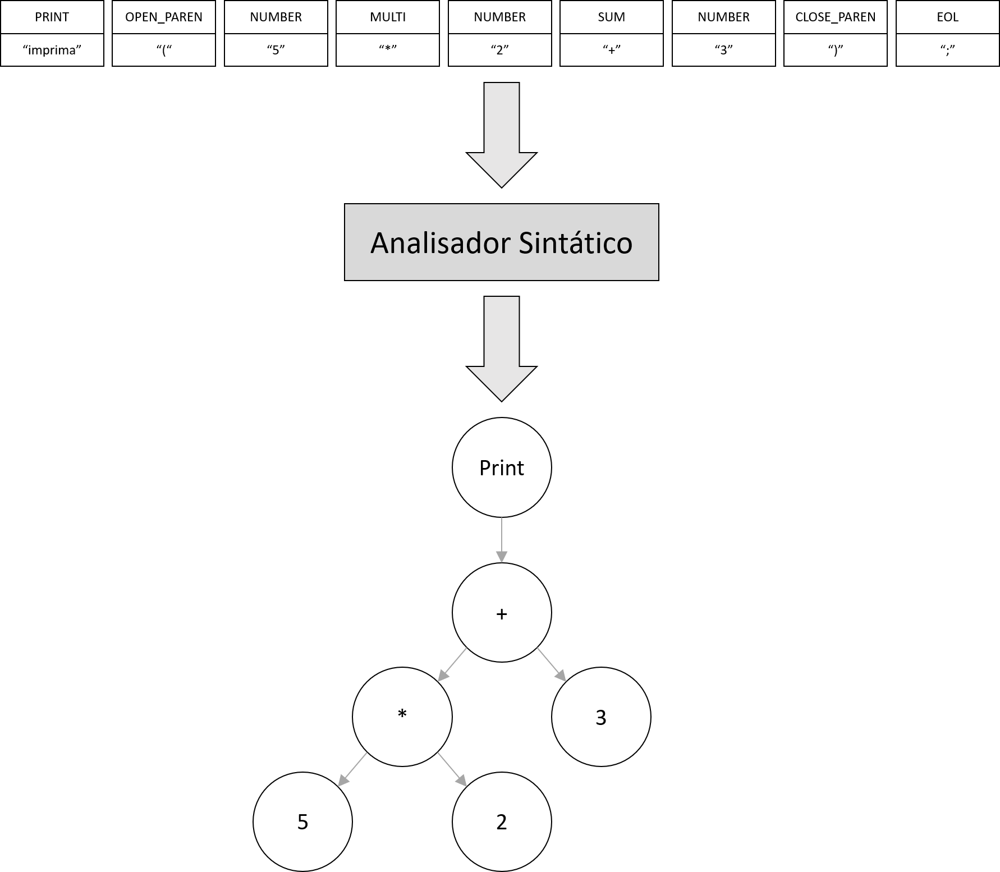
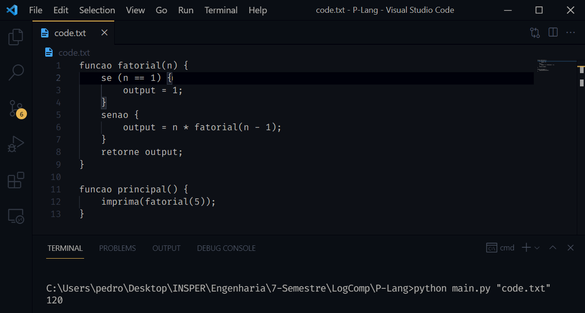

# Compilador para uma linguagem em português

## Introdução

Esse projeto tem como objetivo criar uma linguagem de programação, além de um programa capaz de interpretar essa linguagem e gerar as saídas esperadas do programa. A linguagem deve ser implementada para falantes da língua portuguesa e ter todas as estruturas básicas de uma linguagem de programação: variáveis, condicionais, loops e funções.

Para o projeto foi utilizada a biblioteca RPLY para fazer a análise léxica e o *parsing* da linguagem. Para instalar a biblioteca basta utilizar o comando `pip install rply` no terminal.

## Linguagem

A linguagem proposta, que vamos chamar de **P-Lang**, pode ser descrita por uma EBNF como pode ser visto abaixo.

~~~
FUNC-SEQ = FUNC-DECLARATION, { FUNC_SEQ } ;
FUNC-DECLARATION = "funcao", IDENTIFIER, "(", [PARAM-LIST], ")", BLOCK ;
BLOCK = "{", { COMMAND }, "}" ;
COMMAND = ( λ | ASSIGNMENT | EXPRESSION | WHILE-STATEMENT | IF-STATEMENT | | RETURN | PRINT ) ;
ASSIGNMENT = IDENTIFIER, "=", EXPRESSION, ";" ;
IDENTIFIER = LETTER, { LETTER | DIGIT | "_" } ;
WHILE-STATEMENT = "enquanto", CONDITION-LIST, "{" BLOCK "}" ; 
IF-STATEMENT = "se", CONDITION-LIST, BLOCK,  [ELSE-STATEMENT] ;
ELSE-STATEMENT = ( "senao", BLOCK, | "senao", IF-STATEMENT ) ;
CONDITION-LIST = ( CONDITION | CONDITION, CONDITION-LIST ) ;
CONDITION = ( EXPRESSION, LOGICAL-OPERATOR, EXPRESSION | LOGICAL-OPERATOR, EXPRESSION ) ;
OPERATOR = ( ARITHMETIC-OPERATOR | LOGICAL-OPERATOR ) ;
ARITHIMETIC-OPERATOR = ( "+" | "-" | "*" | "/" | "%" ) ;
LOGICAL-OPERATOR = ( ">" | "<" | ">=" | "<=" | "==" | "!=" | "e" | "ou" | "nao" ) ;
PARAM-LIST = IDENTIFIER, { ",", IDENTIFIER } ;
PRINT = "imprima", "(", EXPRESSION, ")", ";" ;
RETURN = "retorna", [EXPRESSION], ";" ;
EXPRESSION = [( "!" | "+" | "-" )], ( IDENTIFIER | NUMBER | BOOL ), {OPERATOR, ( NUMBER | IDENTIFIER | BOOL )} ;
NUMBER = DIGIT, { DIGIT } ;
BOOL = ( "verdadeiro" | "falso" ) ;
LETTER = ( a | ... | z | A | ... | Z ) ;
DIGIT = ( 1 | 2 | 3 | 4 | 5 | 6 | 7 | 8 | 9 | 0 ) ;
~~~

A partir da ideia descrita pela EBNF podemos gerar o seguinte exemplo de código:

~~~
funcao fatorial(n) {
    se (n == 1) {
        resultado = 1;
    }
    senao {
        resultado = n * fatorial(n - 1);
    }
    retorne resultado;
}

funcao principal() {
    valor = 5;
    enquanto (valor > 0) {
        imprima(fatorial(valor));
        valor = valor - 1;
    } 
}
~~~

Vale destacar que um programa da linguagem proposta sempre deve começar na função **principal**.

## Compilador

Um compilador é um programa que transforma um código em uma determinada liguagem de programação em código de máquina ou em outras linguagens. Um compilador pode ser dividido em, pelo menos, 4 partes:

1. Análise Léxica
2. Análise Sintática
3. Análise Semântica
4. Geração de Código

Nesse projeto foram implementadas as 3 primeiras etapas com ajuda do RPLY.

### Análise Léxica

O papel desse primeiro estágio do compilador é receber um código P-Lang e dividí-lo em *Tokens*.

    

O RPLY torna isso muito simples ao fornecer uma classe chamada **LexerGenerator** e utilizando a estrutura abaixo realiza a tarefa em questão:

~~~py
class Lexer:
    def __init__(self):
        self.lexer = LexerGenerator()

    def _add_tokens(self):
        self.lexer.add("SUM", r"\+")
        self.lexer.ignore("\s+")
    
    def get_lexer(self):
        self._add_tokens()
        return self.lexer.build()
~~~

Na função privada `_add_tokens` são passados os tokens possíveis através da chamada do método **add**. Ela recebe dois argumentos:

1. Nome ou tipo do token.
2. Expressão regular que define a string do código que deve ser interpretada como um token desse tipo.

Além disso, o método **ignore** é responsável por definir a expressão regular que pode ser ignorada pelo analisador léxico sem apontar algum erro. Nesse caso, qualquer token que represente um espaço em brnaco.

Vale destacar que no exemplo acima temos um analisador léxico capaz de tokenizar apenas o sinal de soma. No analisador léxico completo existem muitos outros tokens sendo levados em conta. 

Por exemplo, com o exemplo abaixo:

~~~
imprima(5 * 2 + 3);
~~~

O analisador léxico divide o input em:

~~~py
Token('PRINT', 'imprima')
Token('OPEN_PAREN', '(')
Token('NUMBER', '5')
Token('MULTI', '*')
Token('NUMBER', '2')
Token('SUM', '+')
Token('NUMBER', '3')
Token('CLOSE_PAREN', ')')
Token('EOL', ';')
~~~

### Análise Sintática e Análise Semântica

A análise sintática é responsável por fazer a leitura dos *tokens* gerados no passo anterior e verifica a sintaxe do programa. Assim, o analisador sintático é capaz de gerar como saída uma árvore sintática abstrata, que em inglês é representada pela sigla AST, para representar o código P-Lang que está sendo compilado.

A partir do mesmo exemplo anterior, temos que o analisador sintático gera como saída a seguinte AST:

    

Já o analisador semântico é responsável por verificar se o programa faz sentido. Ou seja, ele deve verificar se, mesmo que a sintaxe esteja impecável, o programa faz sentido. Dois bons exemplos de quando o programa não faz sentido são:

1. Declaração da mesma função múltiplas vezes.
2. Operação com variável não declarada.

Para fazer isso no RPLY foram criados três arquivos. O primeiro é o `ast.py`, que define as classes de nós que podem aparecer em uma AST. O segundo é o `parser.py`, que é responsável por chamar as classes definidas em `ast.py` e efetivamente montar a AST que representa o código P-Lang em questão. Finalmente, há também o arquivo `symbol_table.py` em que é definida a classe que é resposável por guardar os valores de variáveis de cada função. Dessa forma, garantindo que cada variável seja válida somente na função em que ela foi definida.

Um exemplo de uma classe definida em `ast.py` é:

~~~py
class Print:
    def __init__(self, value):
        self.value = value

    def eval(self, func_name):
        print(self.value.eval(func_name))
~~~

Essa classe acima define o nó que deve ser criado quando o comando `imprima` aparecer no código. Toda classe presente em `ast.py` deve possuir um método `__init__` que recebe como argumento tudo que é necessário para a criação de um nó da classe em questão e um método `eval` que recebe como argumento o nome da função que define o escopo do comando.

No caso do `parser.py`, o RPLY utiliza uma notação bem parecida com a EBNF para interpretar o código P-Lang. Abaixo temos uma exemplo de como a classe **ParserGenerator** deve ser usada:

~~~py
class Parser():
    def __init__(self):
        self.pgen = ParserGenerator(
            ['NUMBER', 'PRINT', 'OPEN_PAREN', 'CLOSE_PAREN',
             'EOL', 'SUM', 'SUB']
        )

    def parse(self):
        @self.pgen.production('program : PRINT OPEN_PAREN expression CLOSE_PAREN EOL')
        def program(p):
            return Print(p[2])

        @self.pgen.production('expression : expression SUM expression')
        @self.pgen.production('expression : expression SUB expression')
        def expression(p):
            left = p[0]
            right = p[2]
            operator = p[1]
            if operator.gettokentype() == 'SUM':
                return Sum(left, right)
            elif operator.gettokentype() == 'SUB':
                return Sub(left, right)

        @self.pgen.production('expression : NUMBER')
        def number(p):
            return Number(p[0].value)

        @self.pgen.error
        def error_handle(token):
            raise ValueError(token)

    def get_parser(self):
        return self.pgen.build()
~~~

No exemplo acima temos a criação do **ParserGenerator** com a lista de tokens que ele deve aceitar. Além disso, temos as regras de produção sendo definidas em `@self.pgen.production` e logo após cada sequência de regras de produção temos uma função que define o que deve ser feito caso uma dessas regras seja atendida. É nessas funções que são usadas as classes de nós definidas em `ast.py`. Ademais, há uma regra que define o que deve ser feito caso alguma estrutura no código não se encaixe em nenhuma das regras. Isso é definido em `@self.pgen.error`. Finalmente, existe o método `get_parser` que é chamado para montar a AST a partir do código de entrada e das regras definidas.

Para unir todas as pontas do projeto há o arquivo `main.py` que recebe um arquivo contendo um código P-Lang, faz a tokenização a partir do analisador léxico que foi construído e, com os tokens em mãos, monta a AST correspondente ao código com ajuda de `ast.py`, `parser.py` e `symbol_table.py`. Ou seja, para rodar o programa basta utilizar o seguinte comando:

~~~
python main.py "codigo_p-lang.txt"
~~~

## Exemplo de Uso

    

